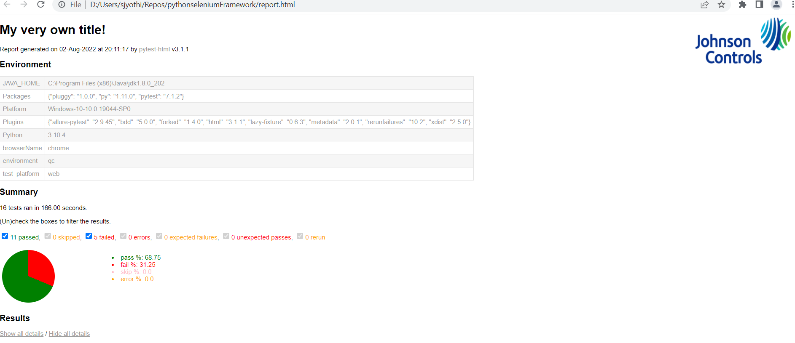
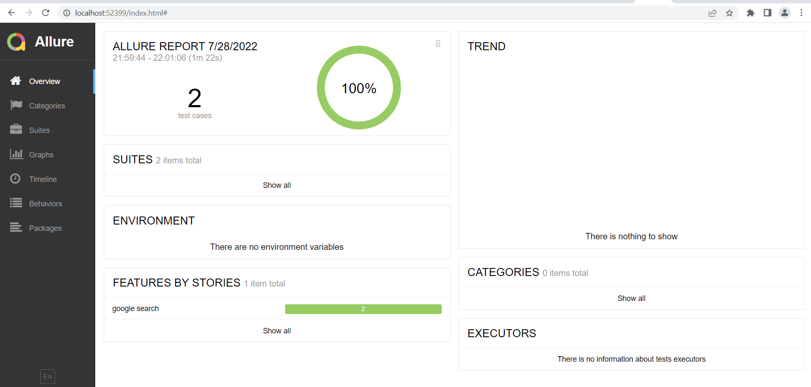
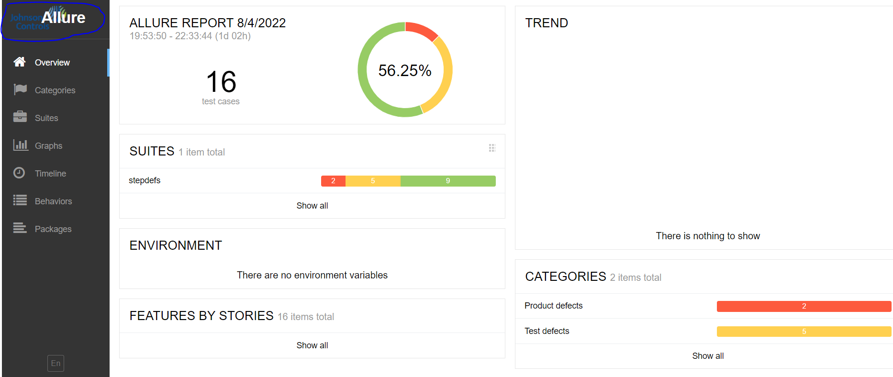

## PYTHON SELENIUM FRAMEWORK

Framework designed to work with both PyTest and unittest. Migration from unittest to PyTest is allowed but not from Pytest to unittest.  

This framework supports both BDD and TDD style testing  

Framework runs on pyallied wrapper which is a python based library developed with pytest. it supports web, mobile (web and native) and api automation.  
pyallied wrapper is published to pypi and it is mentioned as dependency in requirements.txt file in this framework.
### Get Start:  

prerequisites:

1. pythons version >=3.9  
### windows:  
 Recommends to install python from https://www.python.org/ as the installer comes with py.exe which suports easy transition of framewrok testing on different python versions.
ex: To test on python 3.9 and 3.10 we can use below commands respectively.
```shell
py -3.9 -m pytest -m 't'  -rA -n 1 --html=report.html --self-contained-html --b=chrome --e=qc --t=web -v
``` 
```shell
py -3.10 -m pytest -m 't'  -rA -n 1 --html=report.html --self-contained-html --b=chrome --e=qc --t=web -v
``` 
### linux:   

Need to install python >=3.9 with ssl enabled. follow the steps mentined below if ssl error occurs.   

setting up the ssl from source code:  
```shell
1. sudo yum update
2. sudo yum group install 'Development Tools'
3. sudo yum install perl-core zlib-devel -y
4.cd /usr/local/src/
5. sudo wget https://www.openssl.org/source/openssl-1.1.1c.tar.gz
6. sudo tar -xf openssl-1.1.1c.tar.gz
7. cd openssl-1.1.1c
8. sudo ./config --prefix=/usr --openssldir=/etc/ssl --libdir=lib shared zlib-dynamic -Wl,-rpath=/usr/local/ssl/lib -Wl,--enable-new-dtags
9. sudo make install


```
refer below links for more info:

1. https://cloudwafer.com/blog/installing-openssl-on-centos-7/

2. https://gist.github.com/fernandoaleman/5459173e24d59b45ae2cfc618e20fe06  


Follow below steps to install python   


if python is built from source, configure it with below command and install it

```shell
1. sudo yum install openssl-devel bzip2-devel libffi-devel
2. sudo yum groupinstall "Development Tools"
3. sudo wget https://www.python.org/ftp/python/3.10.2/Python-3.10.2.tgz
4. sudo tar -xzf Python-3.10.2.tgz
5. cd Python-3.10.2
6. sudo ./configure --enable-optimizations --with-ssl-default-suites=openssl --with-openssl=/usr/local/ssl --with-openssl-rpath=auto  CFLAGS="-I/usr/local/ssl/include" LDFLAGS="-L/usr/local/ssl"

7.sudo make install
```
Refer below link for more info:
1. https://linuxstans.com/how-to-install-python-centos/
Verify after installation ssl related errors are not displaying.

NOTE: use 'python3.XX' in place of 'py -3' while testing on linux environment  

example command for linux:   
```shell
python3.10 -m pytest -m 't'  -rA -n 1 --html=report.html --self-contained-html --b=chrome --e=qc --t=web -v
```

clone the code from git using below command  
```shell
git clone https://github.com/srinivasaraojyothi/pythonseleniumframework.git  

and   

cd ~pythonseleniumframework
```
Frework clone will have by default with following folders and files
### folders:

1. features 
2. pages
3. stepdefs
4. testdata
5. tmp
6. webElement_Screenshots
7. page_Screenshots
8. logo
9. report_styles

### files
1. conftest.py
2. config.py
3. env.json
4. pytest.ini
5. requirements.txt
6. suite.py
7. .gitignore
8. gitmodules

features, pages, stepdefs folders has sample scripts as examples to follow.  

features : this folder is to keep all the features files. subfolder structure is allowed.  
pages: page objects of each page of AUT. subfolder structure is allowed.
stepdefs : actual tests folder. 
## conftest.py

This file handles the following actions:  
1. driver initialization
2. report generation
3. environment particular data setp etc...  

### How to execute test cases  

As the framework built on pyTest test engine, it support all the features of pyTest.

```
py -3 -m pytest -m 't'  -rA -n 1 --html=report.html --self-contained-html --b=chrome --e=qc --t=web -v
```

--b : browser (allowed are chrome,firefox) 
--e : environment  
--t : tested on (allowed are web, n_mob,w_mob)

To rerun failed test cases:  

```shell
py -3 -m pytest -n 2 --html=report.html --self-contained-html --driver=chrome --env=prod --reruns 1
```
### pytest-html report - Logo insert  
style sheets are kept under folder 'report_styles'  

report_gen.css - for inserting the logo.  
summarypiechart.css - for inserting pie chart under summary section.  
To insert logo into the default pytest html report, user should keep the logo in jpg/png/gif format under folder -logo,and needs to update the logo image path in 'report_gen.css' file as mentioned below  
``` shell
background: url("../logo/jci_logo.png");
```
uncomment html report hook 'def pytest_runtest_makereport 'code. if you run with commented code, it wont attach the screenshots, only report will be generated. 

and execute with the below command 
``` python
py -3 -m pytest -n 2  -rA  --html=report.html  --css=report_styles\\report_gen.css --b=chrome --e=qc --t=web -v
```
Generated report sample screenshot


### pytest-html report- pie chart insertion under summary section
style sheets are kept under folder 'report_styles'  

report_gen.css - for inserting the logo.  
summarypiechart.css - for inserting pie chart under summary section.  

To reflect the pie chart, user needs to uncomment the below hook code in conftest.py file  

1. def pytest_html_results_summary 
2. uncomment html report hook 'def pytest_runtest_makereport 'code. if you run with commented code, it wont attach the screenshots, only report will be generated.  

execute below command
 ```
 py -3 -m pytest -n 2  -rA  --html=report.html  --css=report_styles\\report_gen.css --b=chrome --e=qc --t=web -v
 ``` 





### Allure Report Generation   - (manual)

need to install:
pip install allure-pytest

Note: installation of 'allure-pytest-bdd' is NOT recommended
Note: uncomment the allure generation code in conftest.py file and comment the defaulte pytest html report code in conftest.py file.
There is open bug w.r.t pytest-bdd with allure-bdd.  
refer https://github.com/allure-framework/allure-python/issues/636  

prerequisites:(local execution)  
 1. Need to download allure zip from allure sie - https://github.com/allure-framework/allure2/releases/  
 2. unzip the folder
 Execute the test suite/test cases with following command
 
 ```shell
 py -3 -m pytest -m 'm'  -rA  --alluredir allurereports --b=chrome --e=qc --t=web -v
 ```
report data will be updated to 'allurereports' folder, then generate the report with following commands

```shell
<unzipped allure folder location>\bin\allure.bat generate <path>\allurereports <path>\allure-report

ex: D:\Users\sjyothi\allure2\allure-2.18.1\bin\allure.bat generate D:\Users\sjyothi\Repos\pythonseleniumFramework\allurereports D:\Users\sjyothi\Repos\pythonseleniumFramework\allure-report
```
report will be generated to 'allure-report' folder

serve the report with following command

```shell
<unzipped allure folder location>\bin\allure.bat open -h localhost -p 52399
```
allure sample screenshot



Note: if you install allure_pytest_bdd and allure-pytest, then above mentioned allure execution command wont work. You need to execute the test cases with below command. allure_pytest_bdd works with unittest.
``` shell

 py -3 -m pytest -m 'm'  -rA  --alluredir allurereports --b=chrome --e=qc --t=web -v

 instead of above, run with below command

py -3 -m pytest -m 'j'  -rA -p no:allure_pytest_bdd  --alluredir=allurereports --b=chrome --e=qc --t=web -v
```
### allure - logo insert  

go to allure installation folder  
```shell
ex: allure-2.18.1\plugins\custom-logo-plugin\static
```
keep the logo image under folder 'static,keep the image of max 5 kb size.  
name the image as 'custom-logo'.  

change the image type in file 'styles.css' file

```shell
background: url('custom-logo.png') no-repeat left center !important;
```


go to 'config' folder

```shell
ex: allure-2.18.1\config
```
we can see following files under 'config' folder
``` shell
1. allure.yaml
2. allure-cucumber
3. allure-junit
```
open 'allure.yaml' file and add below line at under plugins section
```
plugins:

  - custom-logo-plugin
```
Generate the allure and check logo is displaying like below
  

### Mobile :

#### Native - emulator/device:  

Following softwares should be installed on the master node   

1. Appium
2. Android SDK

connect the device in debugmode or create a emulator and bring it up. use following command from 'cmd' to check the device is connected or not.  

```shell
adb devices

command should give following o/p
List of devices attached
emulator-5554   device
```

provide following desired capabilities in the conftest.py  
```shell
            desired_caps = {
                "platformName": "Android",
                "androidInstallTimeout": 180000,
                "avdLaunchTimeout": 1200000,
                "avdReadyTimeout": 1200000,
                "noReset": "true",
                "automationName": "UiAutomator2",
                "appium:deviceName": "pixelT3",
                "appium:app": "D:\\Users\\sjyothi\\Repos\\apks\\Airbnb_v22.21_apkpure.com.apk",
                "appium:appPackage": "com.airbnb.android",
                "appium:appActivity": "com.airbnb.android.feat.homescreen.HomeActivity",
                'chromedriverExecutableDir ': 'D:/Users/sjyothi/Repos/pythonseleniumFramework/testdata',
                'chromedriverChromeMappingFile': "D:/Users/sjyothi/AppData/Roamin/npm/node_modules/appium/node_modules/appium-chromedriver/config/mapping.json",

            }   
```
host url :  'http://localhost:4723/wd/hub'  

NOTE: Change the paths to reflect test server. Framework will start appium and android sdk with given emulator/device name in the fuction ''anodroidEmulatorSetandStart' under module -config.py. OR user can start both appium and sdk manually.   

command to run native mobile app test :
```shell
windows
py -m pytest -m 't'  -rA -n 1 --html=report.html --self-contained-html --b=chrome --e=qc --t=n_mob -v
linux
python3.10 -m pytest -m 't'  -rA -n 1 --html=report.html --self-contained-html --b=chrome --e=qc --t=n_mob -v
```
#### Mobile web - emulator/device:  

Start appium and andriod sdk device/emulator and use following commands to web mobile application test. selenium tests should run on mobile browser.
```shell
windows
py -m pytest -m 't'  -rA -n 1 --html=report.html --self-contained-html --b=chrome --e=qc --t=w_mob -v
linux
python3.10 -m pytest -m 't'  -rA -n 1 --html=report.html --self-contained-html --b=chrome --e=qc --t=w_mob -v
```

### dockerization:

Repo is included with docker-compose file and dockerfile.  
To run in docker environment, user should have test infra that supports the docker execution. ex: browserstack, AWS or local setup of selenoid/ggr.  


Note: conftest.py file should be updated with remote url of docker test infra.  
steps to follow to execute in docker:  

1. create the mount folder with below command
```shell
docker volume create automation 
```

2. Build the image with below command

```shell
docker-compose build --no-cache
```
3. start the image with elow command
```shell
docker-compose up
```
Your tests should start on the remote url provided in conftest.py file.

Environmenatl varibales allowed in docker-compose file are as follows:

ENV gitrepo   
ENV git branch  
ENV PYTHONPATH  
ENV tag  
ENV browser  
ENV exenv   
ENV platform

user can download the mount files from the mount location.


