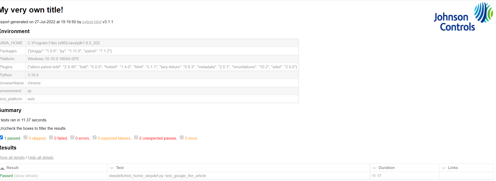

## PYTHON SELENIUM FRAMEWORK

Framework designed to work with both PyTest and unittest. Migration from unittest to PyTest is allowed but not from Pytest to unittest.  

This framework supports both BDD and TDD style testing  

Framework runs on pyallied wrapper which is a python based library developed with pytest. it supports web, mobile (web and native) and api automation.  

### Get Start:  

clone the code from git using below command  
```shell
git clone https://github.com/srinivasaraojyothi/pythonseleniumframework.git  

and   

cd ~pythonseleniumframework
```
Frework clone will have by default with following folders and files
### folders:

1. features 
2. pages
3. stepdefs
4. testdata
5. tmp
6. webElement_Screenshots
7. page_Screenshots
8. logo
9. report_styles

### files
1. conftest.py
2. config.py
3. env.json
4. pytest.ini
5. requirements.txt
6. suite.py
7. .gitignore
8. gitmodules

features, pages, stepdefs folders has sample scripts as examples to follow.  

features : this folder is to keep all the features files. subfolder structure is allowed.  
pages: page objects of each page of AUT. subfolder structure is allowed.
stepdefs : actual tests folder. 
## conftest.py

This file handles the following actions:  
1. driver initialization
2. report generation
3. environment particular data setp etc...  

### How to execute test cases  

As the framework built on pyTest test engine, it support all the features of pyTest.

```
py -3 -m pytest -m 't'  -rA -n 1 --html=report.html --self-contained-html --b=chrome --e=qc --t=w_mob -v
```

--b : browser (allowed are chrome,firefox) 
--e : environment  
--t : tested on (allowed are web, n_mob,w_mob)

To rerun failed test cases:  

```shell
py -3 -m pytest -n 2 --html=report.html --self-contained-html --driver=chrome --env=prod --reruns 1
```
### Logo insert  

To insert logo into the default pytest html report, user should keep the 'logo' in jpg/png/gif format and needs to update the logo path in 'report_gen.css' file as mentioned below  
``` shell
background: url("../logo/jci_logo.png");
```
and execute with the below command
``` python
py -3 -m pytest -m 'smoke'  -rA  --html=report.html  --css=report_styles\\report_gen.css --b=chrome --e=qc --t=web -v
```
Generated report sample screenshot


 
### Allure Report Generation   - (manual)

Note: uncomment the allure generation code in conftest.py file and comment the defaulte pytest html report code in conftest.py file.
There is open bug w.r.t pytest-bdd with allure-bdd.  
refer https://github.com/allure-framework/allure-python/issues/636  

prerequisites:(local execution)  
 1. Need to download allure zip from allure sie - https://github.com/allure-framework/allure2/releases/tag/  
 2. unzip the folder
 Execute the test suite/test cases with following command
 
 ```shell
 py -3 -m pytest -m 'm'  -rA  --alluredir allurereports --b=chrome --e=qc --t=web -v
 ```
report data will be updated to 'allurereports' folder, then generate the report with following commands

```shell
<unzipped allure folder location>\bin\allure.bat generate <path>\allurereports <path>\allure-report

ex: D:\Users\sjyothi\allure2\allure-2.18.1\bin\allure.bat generate D:\Users\sjyothi\Repos\pythonseleniumFramework\allurereports D:\Users\sjyothi\Repos\pythonseleniumFramework\allure-report
```
report will be generated to 'allure-report' folder

serve the report with following command

```shell
<unzipped allure folder location>\bin\allure.bat open -h localhost -p 52399
```
allure sample screenshot

